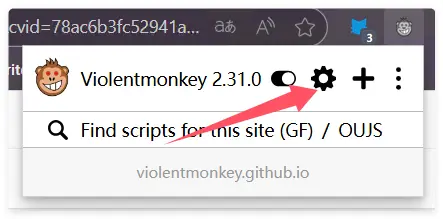

Wenn Sie derzeit Violentmonkey verwenden und zu ScriptCat migrieren möchten, finden Sie hier die Schritte und Tipps, mit denen Sie die Migration reibungslos abschließen können.

## Backup aus Violentmonkey exportieren

Klicken Sie zunächst auf das Violentmonkey-Symbol, um das Verwaltungsfenster zu öffnen

Klicken Sie auf `Einstellungen` und dann auf `Als ZIP-Datei exportieren`, um die Sicherungsdatei zu exportieren

## In ScriptCat importieren

Klicken Sie in der ScriptCat-Erweiterung auf das Dashboard-Symbol, um das Verwaltungsfenster zu öffnen

Wählen Sie `Extras`, klicken Sie dann auf `Datei importieren`, wählen Sie die zuvor exportierte Violentmonkey-ZIP-Datei aus und klicken Sie auf `Öffnen`, um sie zu importieren.

Wählen Sie dann auf der neu geöffneten Seite die Skripte aus, die Sie importieren möchten (oder wählen Sie alle aus), und klicken Sie auf die Schaltfläche `Importieren`.
