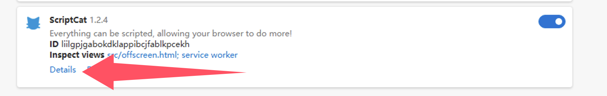

import Tabs from '@theme/Tabs';
import TabItem from '@theme/TabItem';
import { Icon } from "@iconify/react";
import BrowserGuide from '@site/src/components/BrowserGuide';
import GithubStar from '@site/src/components/GithubStar';

<GithubStar variant="bar" scene="install" />

<BrowserGuide texts={{
  allowUserScripts: {
    title: "Ihr Browser unterstützt „Benutzerskripte zulassen'",
    description: "Befolgen Sie die folgenden Schritte, um die Option „Benutzerskripte zulassen' zu aktivieren und ScriptCat normal zu verwenden.",
    button: "Schritte anzeigen",
    anchor: "#allow-user-scripts",
  },
  devMode: {
    title: "Ihr Browser benötigt den aktivierten „Entwicklermodus'",
    description: "Befolgen Sie die folgenden Schritte, um den „Entwicklermodus' zu aktivieren und ScriptCat normal zu verwenden.",
    button: "Schritte anzeigen",
    anchor: "#enable-developer-mode",
  },
  legacy: {
    title: "Ihre Browserversion ist zu alt",
    description: "Ihr Browser unterstützt Manifest V3 nicht. Sie müssen das ältere ScriptCat (v0.16.x) manuell installieren. Anweisungen finden Sie unten.",
  },
  nonChromium: {
    title: "Kein Chromium-basierter Browser erkannt",
    description: "ScriptCat unterstützt derzeit nur Chromium-basierte Browser (wie Chrome, Edge usw.). Wenn Sie einen Chromium-basierten Browser verwenden, ignorieren Sie diese Meldung und befolgen Sie die folgenden Schritte.",
  },
}} />

## Benutzerskripte zulassen {#allow-user-scripts}

[Benutzerskripte zulassen](https://developer.chrome.com/docs/extensions/reference/api/userScripts?hl=en#chrome_versions_138_and_newer_allow_user_scripts_toggle) ist eine neue Funktion von Manifest V3, mit der Benutzerskripte im Browser ausgeführt werden können.

<Tabs groupId="browser" queryString>
  <TabItem value="edge" label={
<Icon height={16} width={16} icon="logos:microsoft-edge" />Edge
} default>

① Öffnen Sie die Erweiterungsverwaltung des Browsers oder besuchen Sie [edge://extensions/](edge://extensions/)

② Suchen Sie in der Erweiterungsverwaltung die ScriptCat-Erweiterung und klicken Sie auf `Details`

③ Suchen Sie auf der Detailseite der ScriptCat-Erweiterung die Option `Benutzerskripte zulassen` und aktivieren Sie sie. Deaktivieren und aktivieren Sie die Erweiterung anschließend erneut oder starten Sie den Browser neu, damit die Skriptfunktion wirksam wird.

> ⚠️⚠️⚠️ Für niedrigere Edge-Versionen (\<=143) oder Benutzer ohne diese Option lesen Sie bitte [Entwicklermodus aktivieren](#enable-developer-mode)

  </TabItem>
  <TabItem value="chrome" label={
<Icon height={16} width={16} icon="logos:chrome" />Chrome
}>

① Öffnen Sie die Erweiterungsverwaltung des Browsers oder besuchen Sie [chrome://extensions/](chrome://extensions/)

② Suchen Sie in der Erweiterungsverwaltung die ScriptCat-Erweiterung und klicken Sie auf `Details`

③ Suchen Sie auf der Detailseite der ScriptCat-Erweiterung die Option `Benutzerskripte zulassen` und aktivieren Sie sie. Deaktivieren und aktivieren Sie die Erweiterung anschließend erneut oder starten Sie den Browser neu, damit die Skriptfunktion wirksam wird.

</TabItem>
  <TabItem value="edge-mobile" label={
<Icon height={16} width={16} icon="logos:microsoft-edge" />Edge Mobile
}>

Für Edge Mobile mit Browser-Engine-Version ≥ 138 ist der Entwicklermodus nicht erforderlich. Aktivieren Sie stattdessen `Benutzerskripte zulassen` in den Erweiterungseinstellungen.

① Öffnen Sie die Erweiterungsliste von Edge Mobile, suchen Sie die ScriptCat-Erweiterung und tippen Sie auf die Schaltfläche `⋮` auf der rechten Seite

② Aktivieren Sie im Popup der Erweiterungseinstellungen `Benutzerskripte zulassen`

③ Deaktivieren und aktivieren Sie die Erweiterung erneut oder starten Sie den Browser neu, damit die Skriptfunktion wirksam wird.

> ⚠️⚠️⚠️ Für Browser-Engine-Versionen unter 138 oder Benutzer ohne diese Option lesen Sie bitte [Entwicklermodus aktivieren](#enable-developer-mode)

  </TabItem>
</Tabs>

## Entwicklermodus aktivieren {#enable-developer-mode}

<Tabs groupId="browser" queryString>
  <TabItem value="edge" label={
<Icon height={16} width={16} icon="logos:microsoft-edge" />Edge
} default>

① Öffnen Sie die Erweiterungsverwaltung des Browsers oder besuchen Sie [edge://extensions/](edge://extensions/)

② Aktivieren Sie `Entwicklermodus` (In einigen Browsern befindet sich dieser Modus möglicherweise in anderen Optionen, z. B. 360 Browser: Erweiterte Verwaltung > Entwicklermodus)

③ Deaktivieren Sie nach dem Aktivieren des Entwicklermodus die Erweiterung und aktivieren Sie sie erneut oder starten Sie den Browser neu, damit die Skriptfunktion wirksam wird.

  </TabItem>
  <TabItem value="chrome" label={
<Icon height={16} width={16} icon="logos:chrome" />Chrome
}>

① Öffnen Sie die Erweiterungsverwaltung des Browsers oder besuchen Sie [chrome://extensions/](chrome://extensions/)

② Aktivieren Sie `Entwicklermodus` (In einigen Browsern befindet sich dieser Modus möglicherweise in anderen Optionen, z. B. 360 Browser: Erweiterte Verwaltung > Entwicklermodus)

③ Deaktivieren Sie nach dem Aktivieren des Entwicklermodus die Erweiterung und aktivieren Sie sie erneut oder starten Sie den Browser neu, damit die Skriptfunktion wirksam wird.

  </TabItem>

<TabItem value="edge-mobile" label={
<Icon height={16} width={16} icon="logos:microsoft-edge" />Edge Mobile
}>

Für Edge Mobile mit Browser-Engine-Versionen unter 138 oder ohne die Option `Benutzerskripte zulassen` tippen Sie oben auf der Erweiterungsseite auf die Einstellungsschaltfläche, um den Entwicklermodus zu aktivieren.

</TabItem>

</Tabs>

:::warning Hinweis zur alten Version

Wenn Sie Windows 8/7/XP-Systeme verwenden oder Ihre Browser-Engine-Version niedriger als 120 ist, müssen Sie das [ältere ScriptCat](https://bbs.tampermonkey.net.cn/thread-3068-1-1.html) manuell installieren. v0.16.x ist die letzte Version, die Manifest V2 unterstützt. Installationsschritte finden Sie unter: [Entpackte Erweiterung laden](/docs/use/use/#load-unpacked-extension-installation).

:::

Technischer Hintergrund: Manifest V3

Aufgrund von Browserbeschränkungen sind Erweiterungen gezwungen, auf Manifest V3 zu aktualisieren, und Manifest-V2-Erweiterungen werden nach Juni 2025 vollständig eingestellt. Unter den Einschränkungen von Manifest V3 müssen Sie den Entwicklermodus oder die Benutzerskript-Funktion aktivieren, um die ScriptCat-Erweiterung normal zu verwenden.

Referenz: [Entwicklermodus für Erweiterungsbenutzer](https://developer.chrome.com/docs/extensions/reference/api/userScripts?hl=en#developer_mode_for_extension_users), [Manifest V3](https://developer.chrome.com/docs/extensions/develop/migrate/what-is-mv3?hl=en)

Für Browser-Engine-Versionen ≥ 138 müssen Sie „Benutzerskripte zulassen" aktivieren. Für niedrigere Versionen verwenden Sie „Entwicklermodus aktivieren".

