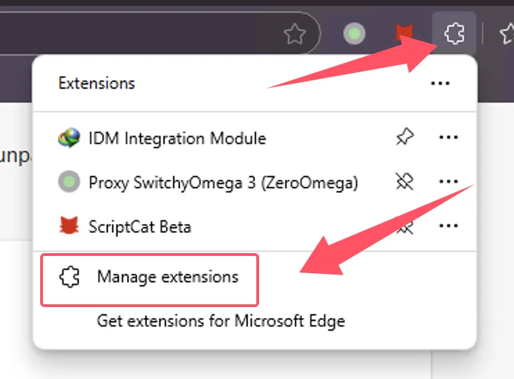

import Tabs from '@theme/Tabs';
import TabItem from '@theme/TabItem';
import { Icon } from "@iconify/react";
import BrowserGuide from '@site/src/components/BrowserGuide';
import GithubStar from '@site/src/components/GithubStar';

<GithubStar variant="bar" scene="install" />

<BrowserGuide texts={{
  allowUserScripts: {
    title: "Su navegador admite 'Permitir scripts de usuario'",
    description: "Siga los pasos a continuación para habilitar la opción 'Permitir scripts de usuario' y usar ScriptCat con normalidad.",
    button: "Ver pasos",
    anchor: "#allow-user-scripts",
  },
  devMode: {
    title: "Su navegador necesita el 'Modo desarrollador' habilitado",
    description: "Siga los pasos a continuación para habilitar el 'Modo desarrollador' y usar ScriptCat con normalidad.",
    button: "Ver pasos",
    anchor: "#enable-developer-mode",
  },
  legacy: {
    title: "La versión de su navegador es demasiado antigua",
    description: "Su navegador no admite Manifest V3. Debe instalar manualmente la versión anterior de ScriptCat (v0.16.x). Consulte las instrucciones a continuación.",
  },
  nonChromium: {
    title: "No se detectó un navegador basado en Chromium",
    description: "ScriptCat actualmente solo admite navegadores basados en Chromium (como Chrome, Edge, etc.). Si está usando un navegador basado en Chromium, ignore este mensaje y siga los pasos a continuación.",
  },
}} />

## Permitir scripts de usuario {#allow-user-scripts}

[Permitir scripts de usuario](https://developer.chrome.com/docs/extensions/reference/api/userScripts?hl=en#chrome_versions_138_and_newer_allow_user_scripts_toggle) es una nueva función de Manifest V3 que permite que los scripts de usuario se ejecuten en el navegador.

<Tabs groupId="browser" queryString>
  <TabItem value="edge" label={
<Icon height={16} width={16} icon="logos:microsoft-edge" />Edge
} default>

① Abra la interfaz de gestión de extensiones del navegador o visite [edge://extensions/](edge://extensions/)

② En la interfaz de gestión de extensiones, busque la extensión de ScriptCat y haga clic en `Detalles`

③ En la página de detalles de la extensión de ScriptCat, busque la opción `Permitir scripts de usuario` y actívela. Luego deshabilite y vuelva a habilitar la extensión, o reinicie el navegador para que la funcionalidad de scripts sea efectiva.

> ⚠️⚠️⚠️ Para versiones anteriores de Edge (\<=143) o usuarios sin esta opción, consulte [Habilitar el modo desarrollador](#enable-developer-mode)

  </TabItem>
  <TabItem value="chrome" label={
<Icon height={16} width={16} icon="logos:chrome" />Chrome
}>

① Abra la interfaz de gestión de extensiones del navegador o visite [chrome://extensions/](chrome://extensions/)

② En la interfaz de gestión de extensiones, busque la extensión de ScriptCat y haga clic en `Detalles`

③ En la página de detalles de la extensión de ScriptCat, busque la opción `Permitir scripts de usuario` y actívela. Luego deshabilite y vuelva a habilitar la extensión, o reinicie el navegador para que la funcionalidad de scripts sea efectiva.

</TabItem>
  <TabItem value="edge-mobile" label={
<Icon height={16} width={16} icon="logos:microsoft-edge" />Edge Mobile
}>

Para Edge Mobile con versión del motor del navegador ≥ 138, no se requiere el modo desarrollador. Active `Permitir scripts de usuario` en la configuración de la extensión.

① Abra la lista de extensiones de Edge Mobile, busque la extensión de ScriptCat y toque el botón `⋮` a la derecha

② En la ventana emergente de configuración de la extensión, active `Permitir scripts de usuario`

③ Deshabilite y vuelva a habilitar la extensión, o reinicie el navegador para que la funcionalidad de scripts sea efectiva.

> ⚠️⚠️⚠️ Para versiones del motor del navegador inferiores a 138, o usuarios sin esta opción, consulte [Habilitar el modo desarrollador](#enable-developer-mode)

  </TabItem>
</Tabs>

## Habilitar el modo desarrollador {#enable-developer-mode}

<Tabs groupId="browser" queryString>
  <TabItem value="edge" label={
<Icon height={16} width={16} icon="logos:microsoft-edge" />Edge
} default>

① Abra la interfaz de gestión de extensiones del navegador o visite [edge://extensions/](edge://extensions/)

② Active el `Modo desarrollador` (En algunos navegadores, este modo puede estar en otras opciones, como 360 Browser: Administración avanzada > Modo desarrollador)

③ Después de activar el modo desarrollador, deshabilite y vuelva a habilitar la extensión, o reinicie el navegador para que la funcionalidad de scripts sea efectiva.

  </TabItem>
  <TabItem value="chrome" label={
<Icon height={16} width={16} icon="logos:chrome" />Chrome
}>

① Abra la interfaz de gestión de extensiones del navegador o visite [chrome://extensions/](chrome://extensions/)

② Active el `Modo desarrollador` (En algunos navegadores, este modo puede estar en otras opciones, como 360 Browser: Administración avanzada > Modo desarrollador)

③ Después de activar el modo desarrollador, deshabilite y vuelva a habilitar la extensión, o reinicie el navegador para que la funcionalidad de scripts sea efectiva.

  </TabItem>

<TabItem value="edge-mobile" label={
<Icon height={16} width={16} icon="logos:microsoft-edge" />Edge Mobile
}>

Para Edge Mobile con versiones del motor del navegador inferiores a 138, o sin la opción `Permitir scripts de usuario`, toque el botón de configuración en la parte superior de la página de extensiones para habilitar el modo desarrollador.

</TabItem>

</Tabs>

:::warning Aviso de versión anterior

Si está usando sistemas Windows 8/7/XP, o la versión de su motor de navegador es inferior a 120, debe instalar manualmente el [ScriptCat anterior](https://bbs.tampermonkey.net.cn/thread-3068-1-1.html). v0.16.x es la última versión que admite Manifest V2. Los pasos de instalación se pueden encontrar en: [Instalación de la extensión sin empaquetar](/docs/use/use/#load-unpacked-extension-installation).

:::

Antecedentes técnicos: Manifest V3

Debido a las restricciones del navegador, las extensiones se ven obligadas a actualizar a Manifest V3, y las extensiones de Manifest V2 se discontinuarán por completo después de junio de 2025. Bajo las limitaciones de Manifest V3, debe habilitar el modo desarrollador o la funcionalidad de scripts de usuario para usar la extensión ScriptCat con normalidad.

Referencia: [Modo desarrollador para usuarios de extensiones](https://developer.chrome.com/docs/extensions/reference/api/userScripts?hl=en#developer_mode_for_extension_users), [Manifest V3](https://developer.chrome.com/docs/extensions/develop/migrate/what-is-mv3?hl=en)

Para versiones del motor del navegador ≥ 138, debe habilitar "Permitir scripts de usuario". Para versiones inferiores, use "Habilitar el modo desarrollador".

