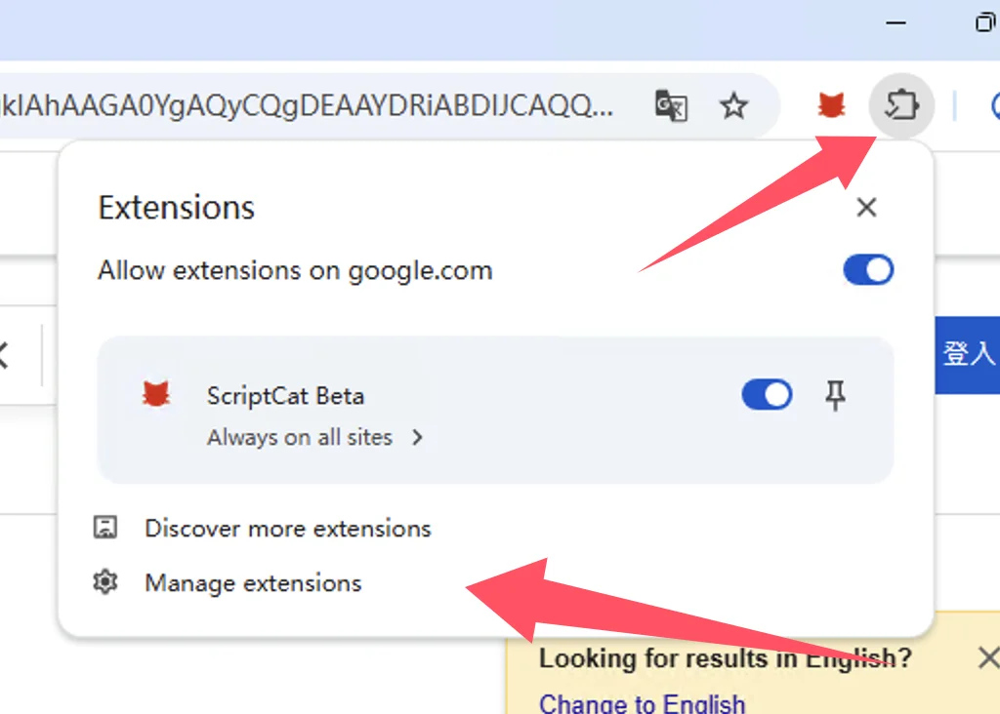
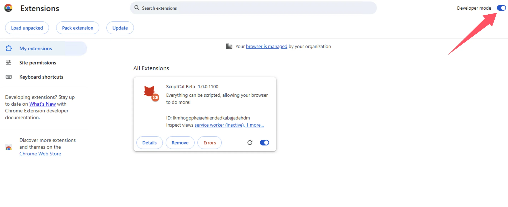

import Tabs from '@theme/Tabs';
import TabItem from '@theme/TabItem';
import { Icon } from "@iconify/react";
import BrowserGuide from '@site/src/components/BrowserGuide';
import GithubStar from '@site/src/components/GithubStar';

<GithubStar variant="bar" scene="install" />

<BrowserGuide texts={{
  allowUserScripts: {
    title: "Il vostro browser supporta 'Consenti script utente'",
    description: "Seguite i passaggi seguenti per abilitare l'opzione 'Consenti script utente' e usare ScriptCat normalmente.",
    button: "Vedi i passaggi",
    anchor: "#allow-user-scripts",
  },
  devMode: {
    title: "Il vostro browser richiede la 'Modalità sviluppatore' abilitata",
    description: "Seguite i passaggi seguenti per abilitare la 'Modalità sviluppatore' e usare ScriptCat normalmente.",
    button: "Vedi i passaggi",
    anchor: "#enable-developer-mode",
  },
  legacy: {
    title: "La versione del vostro browser è troppo vecchia",
    description: "Il vostro browser non supporta Manifest V3. Dovete installare manualmente la versione precedente di ScriptCat (v0.16.x). Vedere le istruzioni seguenti.",
  },
  nonChromium: {
    title: "Nessun browser basato su Chromium rilevato",
    description: "ScriptCat attualmente supporta solo browser basati su Chromium (come Chrome, Edge, ecc.). Se state usando un browser basato su Chromium, ignorate questo messaggio e seguite i passaggi seguenti.",
  },
}} />

## Consenti script utente {#allow-user-scripts}

[Consenti script utente](https://developer.chrome.com/docs/extensions/reference/api/userScripts?hl=en#chrome_versions_138_and_newer_allow_user_scripts_toggle) è una nuova funzionalità di Manifest V3 che consente l'esecuzione degli script utente nel browser.

<Tabs groupId="browser" queryString>
  <TabItem value="edge" label={
<Icon height={16} width={16} icon="logos:microsoft-edge" />Edge
} default>

① Aprite l'interfaccia di gestione delle estensioni del browser o visitate [edge://extensions/](edge://extensions/)

② Nell'interfaccia di gestione delle estensioni, trovate l'estensione ScriptCat e fate clic su `Dettagli`

③ Nella pagina dei dettagli dell'estensione ScriptCat, trovate l'opzione `Consenti script utente` e abilitatela. Quindi disabilitate e riabilitate l'estensione, oppure riavviate il browser per rendere effettiva la funzionalità degli script.

> ⚠️⚠️⚠️ Per versioni precedenti di Edge (\<=143) o utenti senza questa opzione, consultate [Abilitare la modalità sviluppatore](#enable-developer-mode)

  </TabItem>
  <TabItem value="chrome" label={
<Icon height={16} width={16} icon="logos:chrome" />Chrome
}>

① Aprite l'interfaccia di gestione delle estensioni del browser o visitate [chrome://extensions/](chrome://extensions/)

② Nell'interfaccia di gestione delle estensioni, trovate l'estensione ScriptCat e fate clic su `Dettagli`

③ Nella pagina dei dettagli dell'estensione ScriptCat, trovate l'opzione `Consenti script utente` e abilitatela. Quindi disabilitate e riabilitate l'estensione, oppure riavviate il browser per rendere effettiva la funzionalità degli script.

</TabItem>
  <TabItem value="edge-mobile" label={
<Icon height={16} width={16} icon="logos:microsoft-edge" />Edge Mobile
}>

Per Edge Mobile con versione del motore del browser ≥ 138, la modalità sviluppatore non è richiesta. Abilitate invece `Consenti script utente` nelle impostazioni dell'estensione.

① Aprite l'elenco delle estensioni di Edge Mobile, trovate l'estensione ScriptCat e toccate il pulsante `⋮` a destra

② Nel popup delle impostazioni dell'estensione, abilitate `Consenti script utente`

③ Disabilitate e riabilitate l'estensione, oppure riavviate il browser per rendere effettiva la funzionalità degli script.

> ⚠️⚠️⚠️ Per versioni del motore del browser inferiori a 138, o utenti senza questa opzione, consultate [Abilitare la modalità sviluppatore](#enable-developer-mode)

  </TabItem>
</Tabs>

## Abilitare la modalità sviluppatore {#enable-developer-mode}

<Tabs groupId="browser" queryString>
  <TabItem value="edge" label={
<Icon height={16} width={16} icon="logos:microsoft-edge" />Edge
} default>

① Aprite l'interfaccia di gestione delle estensioni del browser o visitate [edge://extensions/](edge://extensions/)

② Abilitate la `Modalità sviluppatore` (In alcuni browser, questa modalità può trovarsi in altre opzioni, ad esempio 360 Browser: Gestione avanzata > Modalità sviluppatore)

③ Dopo aver abilitato la modalità sviluppatore, disabilitate e riabilitate l'estensione, oppure riavviate il browser per rendere effettiva la funzionalità degli script.

  </TabItem>
  <TabItem value="chrome" label={
<Icon height={16} width={16} icon="logos:chrome" />Chrome
}>

① Aprite l'interfaccia di gestione delle estensioni del browser o visitate [chrome://extensions/](chrome://extensions/)

② Abilitate la `Modalità sviluppatore` (In alcuni browser, questa modalità può trovarsi in altre opzioni, ad esempio 360 Browser: Gestione avanzata > Modalità sviluppatore)

③ Dopo aver abilitato la modalità sviluppatore, disabilitate e riabilitate l'estensione, oppure riavviate il browser per rendere effettiva la funzionalità degli script.

  </TabItem>

<TabItem value="edge-mobile" label={
<Icon height={16} width={16} icon="logos:microsoft-edge" />Edge Mobile
}>

Per Edge Mobile con versioni del motore del browser inferiori a 138, o senza l'opzione `Consenti script utente`, toccate il pulsante delle impostazioni nella parte superiore della pagina delle estensioni per abilitare la modalità sviluppatore.

</TabItem>

</Tabs>

:::warning Avviso sulla versione precedente

Se utilizzate sistemi Windows 8/7/XP, o la versione del motore del vostro browser è inferiore a 120, dovete installare manualmente il [ScriptCat precedente](https://bbs.tampermonkey.net.cn/thread-3068-1-1.html). v0.16.x è l'ultima versione che supporta Manifest V2. I passaggi di installazione si trovano in: [Installazione dell'estensione non pacchettizzata](/docs/use/use/#load-unpacked-extension-installation).

:::

Contesto tecnico: Manifest V3

A causa delle restrizioni del browser, le estensioni sono costrette ad aggiornare a Manifest V3 e le estensioni Manifest V2 verranno completamente interrotte dopo giugno 2025. Sotto le limitazioni di Manifest V3, dovete abilitare la modalità sviluppatore o la funzionalità degli script utente per usare normalmente l'estensione ScriptCat.

Riferimento: [Modalità sviluppatore per gli utenti di estensioni](https://developer.chrome.com/docs/extensions/reference/api/userScripts?hl=en#developer_mode_for_extension_users), [Manifest V3](https://developer.chrome.com/docs/extensions/develop/migrate/what-is-mv3?hl=en)

Per versioni del motore del browser ≥ 138, dovete abilitare "Consenti script utente". Per le versioni inferiori, usate "Abilitare la modalità sviluppatore".

