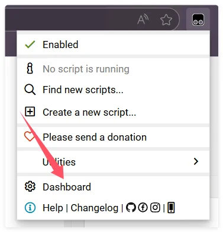

現在 Tampermonkey を使用していて ScriptCat に移行したい場合は、以下の手順とヒントでスムーズに移行できます。

## Tampermonkey からバックアップをエクスポートする

まず、Tampermonkey のアイコンをクリックして管理パネルを開きます

`ユーティリティ` をクリックし、zip ファイルのセクションで `エクスポート` をクリックすると、zip ファイルをエクスポートできます

## ScriptCat にインポートする

ScriptCat 拡張機能で、管理パネルのアイコンをクリックして管理パネルを開きます

`ツール` を選択し、`ファイルをインポート` をクリックして、先ほどエクスポートした Tampermonkey の zip ファイルを選択し、`開く` をクリックしてインポートします。

開いたページで、インポートしたいスクリプトを選択（またはすべて選択）し、`インポート` ボタンをクリックします。
