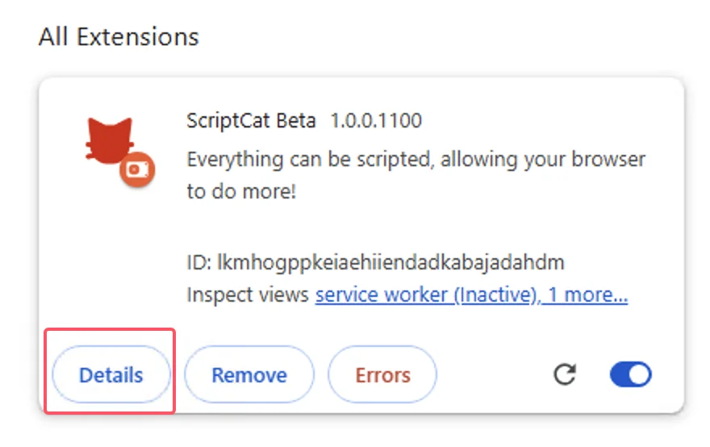

import Tabs from '@theme/Tabs';
import TabItem from '@theme/TabItem';
import { Icon } from "@iconify/react";
import BrowserGuide from '@site/src/components/BrowserGuide';
import GithubStar from '@site/src/components/GithubStar';

<GithubStar variant="bar" scene="install" />

<BrowserGuide texts={{
  allowUserScripts: {
    title: "お使いのブラウザは「ユーザースクリプトを許可」に対応しています",
    description: "以下の手順に従って「ユーザースクリプトを許可」オプションを有効にすると、ScriptCat を正常に使用できます。",
    button: "手順を見る",
    anchor: "#allow-user-scripts",
  },
  devMode: {
    title: "お使いのブラウザでは「開発者モード」の有効化が必要です",
    description: "以下の手順に従って「開発者モード」を有効にすると、ScriptCat を正常に使用できます。",
    button: "手順を見る",
    anchor: "#enable-developer-mode",
  },
  legacy: {
    title: "お使いのブラウザのバージョンが古すぎます",
    description: "お使いのブラウザは Manifest V3 に対応していません。旧バージョンの ScriptCat（v0.16.x）を手動でインストールする必要があります。以下の手順を参照してください。",
  },
  nonChromium: {
    title: "Chromium ベースのブラウザが検出されませんでした",
    description: "ScriptCat は現在、Chromium ベースのブラウザ（Chrome、Edge など）のみをサポートしています。Chromium ベースのブラウザを使用している場合は、このメッセージを無視して以下の手順に従ってください。",
  },
}} />

## ユーザースクリプトを許可 {#allow-user-scripts}

[ユーザースクリプトを許可](https://developer.chrome.com/docs/extensions/reference/api/userScripts?hl=en#chrome_versions_138_and_newer_allow_user_scripts_toggle)は、ユーザースクリプトをブラウザで実行できるようにする Manifest V3 の新機能です。

<Tabs groupId="browser" queryString>
  <TabItem value="edge" label={
<Icon height={16} width={16} icon="logos:microsoft-edge" />Edge
} default>

① ブラウザの拡張機能管理画面を開くか、[edge://extensions/](edge://extensions/)にアクセスします

② 拡張機能管理画面で ScriptCat 拡張機能を見つけ、`詳細` をクリックします

③ ScriptCat 拡張機能の詳細ページで、`ユーザースクリプトを許可` オプションを見つけて有効にします。その後、拡張機能を無効にして再度有効にするか、ブラウザを再起動すると、スクリプト機能が有効になります。

> ⚠️⚠️⚠️ バージョンの低い Edge ブラウザ（\<=143）またはこのオプションがないユーザーは、[開発者モードを有効にする](#enable-developer-mode)を参照してください

  </TabItem>
  <TabItem value="chrome" label={
<Icon height={16} width={16} icon="logos:chrome" />Chrome
}>

① ブラウザの拡張機能管理画面を開くか、[chrome://extensions/](chrome://extensions/)にアクセスします

② 拡張機能管理画面で ScriptCat 拡張機能を見つけ、`詳細` をクリックします

③ ScriptCat 拡張機能の詳細ページで、`ユーザースクリプトを許可` オプションを見つけて有効にします。その後、拡張機能を無効にして再度有効にするか、ブラウザを再起動すると、スクリプト機能が有効になります。

</TabItem>
  <TabItem value="edge-mobile" label={
<Icon height={16} width={16} icon="logos:microsoft-edge" />Edge Mobile
}>

ブラウザエンジンバージョン ≥ 138 の Edge Mobile では、開発者モードは必要ありません。代わりに拡張機能の設定で `ユーザースクリプトを許可` を有効にしてください。

① Edge Mobile の拡張機能リストを開き、ScriptCat 拡張機能を見つけて、右側の `⋮` ボタンをタップします

② 拡張機能の設定ポップアップで、`ユーザースクリプトを許可` を有効にします

③ 拡張機能を無効にして再度有効にするか、ブラウザを再起動すると、スクリプト機能が有効になります。

> ⚠️⚠️⚠️ ブラウザエンジンバージョンが 138 未満の場合、またはこのオプションがないユーザーは、[開発者モードを有効にする](#enable-developer-mode)を参照してください

  </TabItem>
</Tabs>

## 開発者モードを有効にする {#enable-developer-mode}

<Tabs groupId="browser" queryString>
  <TabItem value="edge" label={
<Icon height={16} width={16} icon="logos:microsoft-edge" />Edge
} default>

① ブラウザの拡張機能管理画面を開くか、[edge://extensions/](edge://extensions/)にアクセスします

② `開発者モード` を有効にします（一部のブラウザでは、このモードが他のオプションにある場合があります。例: 360 ブラウザ: 詳細管理 > 開発者モード）

③ 開発者モードを有効にした後、拡張機能を無効にして再度有効にするか、ブラウザを再起動すると、スクリプト機能が有効になります。

  </TabItem>
  <TabItem value="chrome" label={
<Icon height={16} width={16} icon="logos:chrome" />Chrome
}>

① ブラウザの拡張機能管理画面を開くか、[chrome://extensions/](chrome://extensions/)にアクセスします

② `開発者モード` を有効にします（一部のブラウザでは、このモードが他のオプションにある場合があります。例: 360 ブラウザ: 詳細管理 > 開発者モード）

③ 開発者モードを有効にした後、拡張機能を無効にして再度有効にするか、ブラウザを再起動すると、スクリプト機能が有効になります。

  </TabItem>

<TabItem value="edge-mobile" label={
<Icon height={16} width={16} icon="logos:microsoft-edge" />Edge Mobile
}>

ブラウザエンジンバージョンが 138 未満、または `ユーザースクリプトを許可` オプションがない Edge Mobile では、拡張機能ページ上部の設定ボタンをタップして開発者モードを有効にします。

</TabItem>

</Tabs>

:::warning 旧バージョンに関する注意

Windows 8/7/XP システムを使用している場合、またはブラウザエンジンバージョンが 120 未満の場合は、[旧バージョンの ScriptCat](https://bbs.tampermonkey.net.cn/thread-3068-1-1.html)を手動でインストールする必要があります。v0.16.x は Manifest V2 をサポートする最後のバージョンです。インストール手順は、[展開済み拡張機能のインストール](/docs/use/use/#load-unpacked-extension-installation)を参照してください。

:::

技術的背景: Manifest V3

ブラウザの制限により、拡張機能は Manifest V3 へのアップグレードを余儀なくされており、Manifest V2 の拡張機能は 2025 年 6 月以降、完全に廃止されます。Manifest V3 の制約の下では、ScriptCat 拡張機能を正常に使用するために、開発者モードまたはユーザースクリプト機能を有効にする必要があります。

参考: [拡張機能ユーザーのための開発者モード](https://developer.chrome.com/docs/extensions/reference/api/userScripts?hl=en#developer_mode_for_extension_users)、[Manifest V3](https://developer.chrome.com/docs/extensions/develop/migrate/what-is-mv3?hl=en)

ブラウザエンジンバージョン ≥ 138 の場合は「ユーザースクリプトを許可」を有効にする必要があります。低いバージョンの場合は「開発者モードを有効にする」を使用してください。

