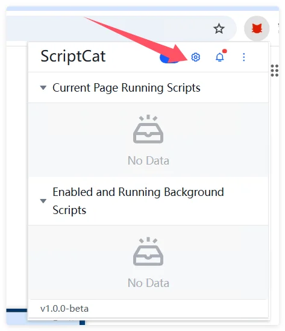

Se você usa o Violentmonkey e quer migrar para o ScriptCat, aqui estão alguns passos e dicas para concluir a migração sem problemas.

## Exportar backup do Violentmonkey

Primeiro, clique no ícone do Violentmonkey para entrar no painel de gerenciamento

Clique em `Configurações` e depois em `Exportar como arquivo zip` para exportar o arquivo de segurança

## Importar para o ScriptCat

Na extensão ScriptCat, clique no ícone do painel de controle para entrar no painel de gerenciamento

Selecione `Ferramentas`, clique em `Importar arquivo`, escolha o arquivo zip do Violentmonkey exportado anteriormente e clique em `Abrir` para importar.

Na página recém-aberta, selecione (ou selecione todos) os scripts que deseja importar e clique no botão `Importar`.
