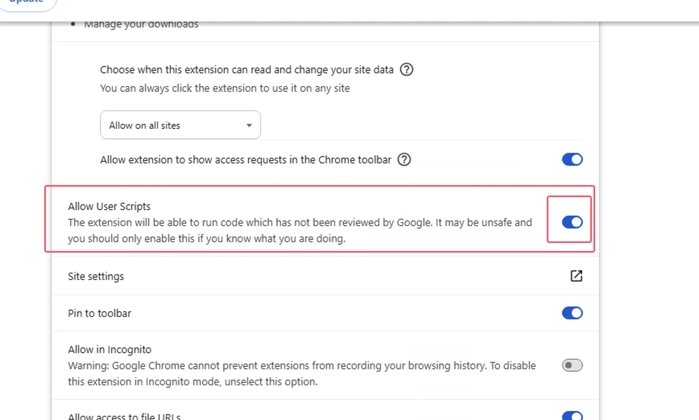

import Tabs from '@theme/Tabs';
import TabItem from '@theme/TabItem';
import { Icon } from "@iconify/react";
import BrowserGuide from '@site/src/components/BrowserGuide';
import GithubStar from '@site/src/components/GithubStar';

<GithubStar variant="bar" scene="install" />

<BrowserGuide texts={{
  allowUserScripts: {
    title: "Seu navegador suporta 'Permitir scripts de usuário'",
    description: "Siga as etapas abaixo para ativar a opção 'Permitir scripts de usuário' e usar o ScriptCat normalmente.",
    button: "Ver etapas",
    anchor: "#allow-user-scripts",
  },
  devMode: {
    title: "Seu navegador precisa do 'Modo desenvolvedor' ativado",
    description: "Siga as etapas abaixo para ativar o 'Modo desenvolvedor' e usar o ScriptCat normalmente.",
    button: "Ver etapas",
    anchor: "#enable-developer-mode",
  },
  legacy: {
    title: "A versão do seu navegador é muito antiga",
    description: "Seu navegador não suporta Manifest V3. Você precisa instalar manualmente a versão anterior do ScriptCat (v0.16.x). Veja as instruções abaixo.",
  },
  nonChromium: {
    title: "Navegador baseado em Chromium não detectado",
    description: "O ScriptCat atualmente suporta apenas navegadores baseados em Chromium (como Chrome, Edge etc.). Se você estiver usando um navegador baseado em Chromium, ignore esta mensagem e siga as etapas abaixo.",
  },
}} />

## Permitir scripts de usuário {#allow-user-scripts}

[Permitir scripts de usuário](https://developer.chrome.com/docs/extensions/reference/api/userScripts?hl=en#chrome_versions_138_and_newer_allow_user_scripts_toggle) é um novo recurso do Manifest V3 que permite que scripts de usuário sejam executados no navegador.

<Tabs groupId="browser" queryString>
  <TabItem value="edge" label={
<Icon height={16} width={16} icon="logos:microsoft-edge" />Edge
} default>

① Abra a interface de gerenciamento de extensões do navegador ou visite [edge://extensions/](edge://extensions/)

② Na interface de gerenciamento de extensões, encontre a extensão ScriptCat e clique em `Detalhes`

③ Na página de detalhes da extensão ScriptCat, encontre a opção `Permitir scripts de usuário` e ative-a. Em seguida, desative e reative a extensão, ou reinicie o navegador para que a funcionalidade de scripts seja efetivada.

> ⚠️⚠️⚠️ Para versões anteriores do Edge (\<=143) ou usuários sem esta opção, consulte [Ativar o modo desenvolvedor](#enable-developer-mode)

  </TabItem>
  <TabItem value="chrome" label={
<Icon height={16} width={16} icon="logos:chrome" />Chrome
}>

① Abra a interface de gerenciamento de extensões do navegador ou visite [chrome://extensions/](chrome://extensions/)

② Na interface de gerenciamento de extensões, encontre a extensão ScriptCat e clique em `Detalhes`

③ Na página de detalhes da extensão ScriptCat, encontre a opção `Permitir scripts de usuário` e ative-a. Em seguida, desative e reative a extensão, ou reinicie o navegador para que a funcionalidade de scripts seja efetivada.

</TabItem>
  <TabItem value="edge-mobile" label={
<Icon height={16} width={16} icon="logos:microsoft-edge" />Edge Mobile
}>

Para Edge Mobile com versão do mecanismo do navegador ≥ 138, o modo desenvolvedor não é necessário. Em vez disso, ative `Permitir scripts de usuário` nas configurações da extensão.

① Abra a lista de extensões do Edge Mobile, encontre a extensão ScriptCat e toque no botão `⋮` à direita

② No pop-up de configurações da extensão, ative `Permitir scripts de usuário`

③ Desative e reative a extensão, ou reinicie o navegador para que a funcionalidade de scripts seja efetivada.

> ⚠️⚠️⚠️ Para versões do mecanismo do navegador inferiores a 138, ou usuários sem esta opção, consulte [Ativar o modo desenvolvedor](#enable-developer-mode)

  </TabItem>
</Tabs>

## Ativar o modo desenvolvedor {#enable-developer-mode}

<Tabs groupId="browser" queryString>
  <TabItem value="edge" label={
<Icon height={16} width={16} icon="logos:microsoft-edge" />Edge
} default>

① Abra a interface de gerenciamento de extensões do navegador ou visite [edge://extensions/](edge://extensions/)

② Ative o `Modo desenvolvedor` (em alguns navegadores, esse modo pode estar em outras opções, como 360 Browser: Gerenciamento avançado > Modo desenvolvedor)

③ Depois de ativar o modo desenvolvedor, desative e reative a extensão, ou reinicie o navegador para que a funcionalidade de scripts seja efetivada.

  </TabItem>
  <TabItem value="chrome" label={
<Icon height={16} width={16} icon="logos:chrome" />Chrome
}>

① Abra a interface de gerenciamento de extensões do navegador ou visite [chrome://extensions/](chrome://extensions/)

② Ative o `Modo desenvolvedor` (em alguns navegadores, esse modo pode estar em outras opções, como 360 Browser: Gerenciamento avançado > Modo desenvolvedor)

③ Depois de ativar o modo desenvolvedor, desative e reative a extensão, ou reinicie o navegador para que a funcionalidade de scripts seja efetivada.

  </TabItem>

<TabItem value="edge-mobile" label={
<Icon height={16} width={16} icon="logos:microsoft-edge" />Edge Mobile
}>

Para Edge Mobile com versões do mecanismo do navegador inferiores a 138, ou sem a opção `Permitir scripts de usuário`, toque no botão de configurações na parte superior da página de extensões para ativar o modo desenvolvedor.

</TabItem>

</Tabs>

:::warning Aviso sobre a versão anterior

Se você estiver usando sistemas Windows 8/7/XP, ou a versão do mecanismo do seu navegador for inferior a 120, você precisa instalar manualmente o [ScriptCat anterior](https://bbs.tampermonkey.net.cn/thread-3068-1-1.html). v0.16.x é a última versão que suporta Manifest V2. As etapas de instalação podem ser encontradas em: [Instalação da extensão não empacotada](/docs/use/use/#load-unpacked-extension-installation).

:::

Contexto técnico: Manifest V3

Devido a restrições do navegador, as extensões são forçadas a atualizar para o Manifest V3, e as extensões de Manifest V2 serão totalmente descontinuadas após junho de 2025. Sob as limitações do Manifest V3, você deve ativar o modo desenvolvedor ou a funcionalidade de scripts de usuário para usar a extensão ScriptCat normalmente.

Referência: [Modo desenvolvedor para usuários de extensões](https://developer.chrome.com/docs/extensions/reference/api/userScripts?hl=en#developer_mode_for_extension_users), [Manifest V3](https://developer.chrome.com/docs/extensions/develop/migrate/what-is-mv3?hl=en)

Para versões do mecanismo do navegador ≥ 138, você precisa ativar "Permitir scripts de usuário". Para versões inferiores, use "Ativar o modo desenvolvedor".

