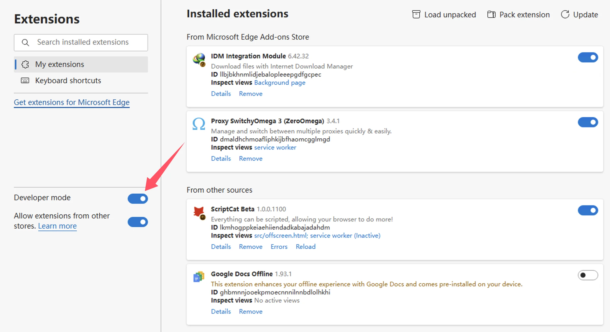

import Tabs from '@theme/Tabs';
import TabItem from '@theme/TabItem';
import { Icon } from "@iconify/react";
import BrowserGuide from '@site/src/components/BrowserGuide';
import GithubStar from '@site/src/components/GithubStar';

<GithubStar variant="bar" scene="install" />

<BrowserGuide texts={{
  allowUserScripts: {
    title: "Trình duyệt của bạn hỗ trợ 'Cho phép tập lệnh người dùng'",
    description: "Hãy làm theo các bước bên dưới để bật tùy chọn 'Cho phép tập lệnh người dùng' và sử dụng ScriptCat bình thường.",
    button: "Xem các bước",
    anchor: "#allow-user-scripts",
  },
  devMode: {
    title: "Trình duyệt của bạn cần bật 'Chế độ nhà phát triển'",
    description: "Hãy làm theo các bước bên dưới để bật 'Chế độ nhà phát triển' và sử dụng ScriptCat bình thường.",
    button: "Xem các bước",
    anchor: "#enable-developer-mode",
  },
  legacy: {
    title: "Phiên bản trình duyệt của bạn quá cũ",
    description: "Trình duyệt của bạn không hỗ trợ Manifest V3. Bạn cần cài đặt thủ công ScriptCat phiên bản cũ (v0.16.x). Xem hướng dẫn bên dưới.",
  },
  nonChromium: {
    title: "Không phát hiện trình duyệt dựa trên Chromium",
    description: "ScriptCat hiện chỉ hỗ trợ các trình duyệt dựa trên Chromium (như Chrome, Edge, v.v.). Nếu bạn đang sử dụng trình duyệt dựa trên Chromium, hãy bỏ qua thông báo này và làm theo các bước bên dưới.",
  },
}} />

## Cho phép tập lệnh người dùng {#allow-user-scripts}

[Cho phép tập lệnh người dùng](https://developer.chrome.com/docs/extensions/reference/api/userScripts?hl=en#chrome_versions_138_and_newer_allow_user_scripts_toggle) là một tính năng mới của Manifest V3 cho phép tập lệnh người dùng chạy trong trình duyệt.

<Tabs groupId="browser" queryString>
  <TabItem value="edge" label={
<Icon height={16} width={16} icon="logos:microsoft-edge" />Edge
} default>

① Mở giao diện quản lý tiện ích mở rộng của trình duyệt hoặc truy cập [edge://extensions/](edge://extensions/)

② Trong giao diện quản lý tiện ích mở rộng, tìm tiện ích mở rộng ScriptCat và nhấp vào `Chi tiết`

③ Trên trang chi tiết tiện ích mở rộng ScriptCat, tìm tùy chọn `Cho phép tập lệnh người dùng` và bật nó. Sau đó, tắt và bật lại tiện ích mở rộng, hoặc khởi động lại trình duyệt để chức năng tập lệnh có hiệu lực.

> ⚠️⚠️⚠️ Đối với các phiên bản Edge thấp hơn (\<=143) hoặc người dùng không có tùy chọn này, vui lòng tham khảo [Bật chế độ nhà phát triển](#enable-developer-mode)

  </TabItem>
  <TabItem value="chrome" label={
<Icon height={16} width={16} icon="logos:chrome" />Chrome
}>

① Mở giao diện quản lý tiện ích mở rộng của trình duyệt hoặc truy cập [chrome://extensions/](chrome://extensions/)

② Trong giao diện quản lý tiện ích mở rộng, tìm tiện ích mở rộng ScriptCat và nhấp vào `Chi tiết`

③ Trên trang chi tiết tiện ích mở rộng ScriptCat, tìm tùy chọn `Cho phép tập lệnh người dùng` và bật nó. Sau đó, tắt và bật lại tiện ích mở rộng, hoặc khởi động lại trình duyệt để chức năng tập lệnh có hiệu lực.

</TabItem>
  <TabItem value="edge-mobile" label={
<Icon height={16} width={16} icon="logos:microsoft-edge" />Edge Mobile
}>

Đối với Edge Mobile có phiên bản công cụ trình duyệt ≥ 138, không cần chế độ nhà phát triển. Thay vào đó, hãy bật `Cho phép tập lệnh người dùng` trong cài đặt tiện ích mở rộng.

① Mở danh sách tiện ích mở rộng của Edge Mobile, tìm tiện ích mở rộng ScriptCat và nhấn vào nút `⋮` ở bên phải

② Trong cửa sổ bật lên cài đặt tiện ích mở rộng, bật `Cho phép tập lệnh người dùng`

③ Tắt và bật lại tiện ích mở rộng, hoặc khởi động lại trình duyệt để chức năng tập lệnh có hiệu lực.

> ⚠️⚠️⚠️ Đối với các phiên bản công cụ trình duyệt thấp hơn 138, hoặc người dùng không có tùy chọn này, vui lòng tham khảo [Bật chế độ nhà phát triển](#enable-developer-mode)

  </TabItem>
</Tabs>

## Bật chế độ nhà phát triển {#enable-developer-mode}

<Tabs groupId="browser" queryString>
  <TabItem value="edge" label={
<Icon height={16} width={16} icon="logos:microsoft-edge" />Edge
} default>

① Mở giao diện quản lý tiện ích mở rộng của trình duyệt hoặc truy cập [edge://extensions/](edge://extensions/)

② Bật `Chế độ nhà phát triển` (Trong một số trình duyệt, chế độ này có thể nằm trong các tùy chọn khác, chẳng hạn như 360 Browser: Quản lý nâng cao > Chế độ nhà phát triển)

③ Sau khi bật chế độ nhà phát triển, hãy tắt và bật lại tiện ích mở rộng, hoặc khởi động lại trình duyệt để chức năng tập lệnh có hiệu lực.

  </TabItem>
  <TabItem value="chrome" label={
<Icon height={16} width={16} icon="logos:chrome" />Chrome
}>

① Mở giao diện quản lý tiện ích mở rộng của trình duyệt hoặc truy cập [chrome://extensions/](chrome://extensions/)

② Bật `Chế độ nhà phát triển` (Trong một số trình duyệt, chế độ này có thể nằm trong các tùy chọn khác, chẳng hạn như 360 Browser: Quản lý nâng cao > Chế độ nhà phát triển)

③ Sau khi bật chế độ nhà phát triển, hãy tắt và bật lại tiện ích mở rộng, hoặc khởi động lại trình duyệt để chức năng tập lệnh có hiệu lực.

  </TabItem>

<TabItem value="edge-mobile" label={
<Icon height={16} width={16} icon="logos:microsoft-edge" />Edge Mobile
}>

Đối với Edge Mobile có phiên bản công cụ trình duyệt thấp hơn 138, hoặc không có tùy chọn `Cho phép tập lệnh người dùng`, hãy nhấn vào nút cài đặt ở đầu trang tiện ích mở rộng để bật chế độ nhà phát triển.

</TabItem>

</Tabs>

:::warning Thông báo về phiên bản cũ

Nếu bạn đang sử dụng hệ thống Windows 8/7/XP, hoặc phiên bản công cụ trình duyệt của bạn thấp hơn 120, bạn cần cài đặt thủ công [ScriptCat phiên bản cũ](https://bbs.tampermonkey.net.cn/thread-3068-1-1.html). v0.16.x là phiên bản cuối cùng hỗ trợ Manifest V2. Các bước cài đặt có thể tìm thấy tại: [Cài đặt tiện ích mở rộng không đóng gói](/docs/use/use/#load-unpacked-extension-installation).

:::

Bối cảnh kỹ thuật: Manifest V3

Do các hạn chế của trình duyệt, các tiện ích mở rộng buộc phải nâng cấp lên Manifest V3 và các tiện ích mở rộng Manifest V2 sẽ bị ngừng hoàn toàn sau tháng 6 năm 2025. Dưới các giới hạn của Manifest V3, bạn phải bật chế độ nhà phát triển hoặc chức năng tập lệnh người dùng để sử dụng tiện ích mở rộng ScriptCat bình thường.

Tham khảo: [Chế độ nhà phát triển cho người dùng tiện ích mở rộng](https://developer.chrome.com/docs/extensions/reference/api/userScripts?hl=en#developer_mode_for_extension_users), [Manifest V3](https://developer.chrome.com/docs/extensions/develop/migrate/what-is-mv3?hl=en)

Đối với các phiên bản công cụ trình duyệt ≥ 138, bạn cần bật "Cho phép tập lệnh người dùng". Đối với các phiên bản thấp hơn, hãy sử dụng "Bật chế độ nhà phát triển".

